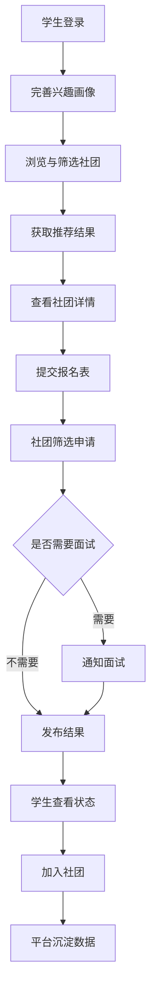

# 社团招新智能平台产品范围与角色边界

## 1. 产品定位

**产品名称**：社团招新智能平台

**产品定位**：面向单校场景的新生社团发现、智能推荐与在线报名平台。

**核心价值**：
- 帮助新生快速找到适合自己的社团
- 帮助社团提升招新效率与筛选质量
- 帮助学校统一管理招新流程和数据

## 2. 建设范围结论

本项目按**单校场景**建设，首期覆盖三个角色：

| 角色 | 是否首期纳入 | 核心职责 | 说明 |
| --- | --- | --- | --- |
| 学生 | 是 | 浏览、匹配、报名、查看结果 | 前台核心用户 |
| 社团负责人 | 是 | 发布招新、筛选报名、处理结果 | 闭环必要角色 |
| 学校管理员 | 是 | 审核社团、配置周期、查看数据 | 平台治理角色 |

## 3. 角色边界

### 3.1 学生端边界

学生端负责完成“发现社团到提交报名”的前台主流程。

**包含功能**：
- 注册登录与身份认证
- 兴趣画像与标签选择
- 社团浏览、搜索、筛选、收藏
- 智能推荐与推荐原因展示
- 在线报名与状态查询
- 接收面试通知与录取结果

**不包含功能**：
- 学生之间即时聊天
- 多校区、多学校切换
- 复杂作品集站内编辑

### 3.2 社团端边界

社团端是保证流程闭环的轻量后台。

**包含功能**：
- 社团资料维护
- 招新计划与岗位发布
- 报名列表筛选与状态更新
- 面试通知与录取结果发送

**不包含功能**：
- 社团内部成员管理全流程
- 经费管理、活动报备等非招新业务

### 3.3 管理端边界

管理端聚焦招新治理，不做复杂校务系统替代。

**包含功能**：
- 社团入驻与招新内容审核
- 招新周期管理
- 通知模板管理
- 平台基础数据看板
- 异常报名与投诉处理

**不包含功能**：
- 校园统一身份系统建设
- 校级组织管理全模块

## 4. 业务闭环定义

平台必须覆盖完整的招新闭环，避免只解决展示、不解决录取的问题。

## 5. 核心业务规则

### BR-01 招新周期规则
- 平台按学校统一招新周期开放
- 非开放期学生可以浏览社团，但不可提交报名

### BR-02 报名状态闭环规则
- 报名状态必须在以下集合中流转：`已提交`、`待筛选`、`待面试`、`已录取`、`未通过`、`已放弃`、`已加入`
- 所有状态变更都需要记录时间与操作角色

### BR-03 社团发布审核规则
- 社团资料和招新计划发布前需通过管理员审核
- 审核未通过时需保留驳回原因

### BR-04 推荐可解释规则
- 推荐结果必须向学生展示至少1条推荐原因
- 推荐原因优先来自兴趣标签、时间偏好、技能匹配

### BR-05 通知触发规则
- 报名提交、状态变更、面试通知、录取结果都应触发消息通知

## 6. 成功指标建议

| 指标 | 定义 | 目标方向 |
| --- | --- | --- |
| 社团浏览转报名率 | 浏览社团详情后提交报名的比例 | 持续提升 |
| 推荐点击率 | 推荐位被点击的比例 | 持续提升 |
| 报名处理时效 | 社团完成初筛的平均时长 | 持续下降 |
| 学生满意度 | 新生对平台体验与推荐结果的评价 | 持续提升 |

## 7. 首期不做事项

- 多学校SaaS化能力
- AI大模型深度对话推荐
- 学生社交社区
- 完整校务系统对接

## 8. 交付建议

后续设计与开发均以以下原则推进：
- **学生端优先**：优先保障发现、推荐、报名体验
- **后台够用即可**：社团端和管理端先满足闭环，不做过度设计
- **智能能力分阶段**：先规则推荐，再做行为优化
