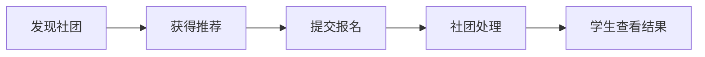

# 社团招新智能平台MVP功能清单

## 1. MVP目标

MVP阶段只解决三个核心问题：
- **信息不对称**：新生不知道有哪些社团、差异是什么
- **匹配低效率**：新生不知道自己适合哪个社团
- **报名流程混乱**：报名、筛选、通知依赖线下或分散渠道

因此第一版目标不是“做全”，而是跑通最小业务闭环：

## 2. MVP范围定义

### 2.1 必须做 Must Have

| 模块 | 功能 | 说明 | 优先级 |
| --- | --- | --- | --- |
| 账户体系 | 学生注册/登录 | 支持手机号或学号登录 | P0 |
| 学生画像 | 兴趣标签、时间偏好、技能标签 | 推荐的基础数据来源 | P0 |
| 社团展示 | 社团列表、详情页 | 至少支持分类、简介、招新要求 | P0 |
| 搜索筛选 | 分类筛选、关键词搜索、排序 | 帮助学生快速缩小范围 | P0 |
| 推荐能力 | 规则推荐排序 | 按标签、时间、技能进行基础匹配 | P0 |
| 报名流程 | 在线报名表提交 | 支持基础信息和补充说明 | P0 |
| 状态追踪 | 学生查看报名进度 | 至少展示当前状态和更新时间 | P0 |
| 社团后台 | 报名列表、状态处理 | 支持初筛与结果更新 | P0 |
| 管理后台 | 社团审核、招新周期配置 | 保证平台治理与周期控制 | P0 |
| 通知能力 | 报名成功、状态更新通知 | 可先做站内消息 | P1 |

### 2.2 应该做 Should Have

| 模块 | 功能 | 说明 | 优先级 |
| --- | --- | --- | --- |
| 收藏能力 | 收藏社团 | 便于学生回看 | P1 |
| 推荐解释 | 展示推荐原因 | 提升推荐可信度 | P1 |
| 面试通知 | 社团发送面试安排 | 满足更多招新场景 | P1 |
| 数据统计 | 基础看板 | 展示报名人数、热门社团 | P1 |

### 2.3 后续再做 Could Have

| 模块 | 功能 | 说明 | 优先级 |
| --- | --- | --- | --- |
| 行为推荐 | 根据浏览/收藏优化推荐 | 需要积累数据 | P2 |
| 宣讲会预约 | 活动预约与提醒 | 增强线下联动 | P2 |
| 地图导航 | 摊位地图、路线引导 | 偏运营增强 | P2 |
| AI问答 | 智能选社建议 | 属于差异化增强 | P2 |
| AI分析 | 社团招新优化建议 | 依赖数据沉淀 | P2 |

## 3. MVP页面建议

### 学生端
- 登录页
- 兴趣画像页
- 社团列表页
- 社团详情页
- 我的报名页
- 消息中心页

### 社团端
- 招新概览页
- 报名列表页
- 报名详情处理页
- 社团资料维护页

### 管理端
- 社团审核页
- 招新周期配置页
- 基础数据看板页

## 4. MVP数据对象

| 数据对象 | 必须字段 | 用途 |
| --- | --- | --- |
| 学生 | 姓名、学号/手机号、学院、专业、兴趣标签、时间偏好 | 构建画像与报名身份 |
| 社团 | 名称、分类、简介、标签、招新状态、负责人 | 用于展示与推荐 |
| 招新计划 | 开始时间、结束时间、岗位方向、人数、报名字段 | 控制报名规则 |
| 报名记录 | 学生ID、社团ID、报名时间、状态、备注 | 追踪招新进度 |
| 通知消息 | 接收人、类型、内容、触发时间 | 状态提醒 |

## 5. MVP业务规则

### BR-MVP-01 推荐规则
- 首期推荐基于固定规则计算，不依赖机器学习模型
- 推荐分值建议由以下维度组成：
  - 兴趣标签匹配
  - 时间偏好匹配
  - 技能标签匹配
  - 社团热度加权

### BR-MVP-02 报名规则
- 每条报名记录只允许对应一个学生和一个社团
- 同一学生对同一社团不能重复提交有效报名

### BR-MVP-03 审核规则
- 社团未通过管理员审核前，不可在学生端公开展示

### BR-MVP-04 状态规则
- 社团负责人必须对报名记录进行明确处理，避免长期停留在无反馈状态

## 6. 迭代划分建议

| 阶段 | 时间建议 | 目标 | 功能范围 |
| --- | --- | --- | --- |
| V1.0 | 首次上线 | 跑通报名闭环 | P0功能 |
| V1.1 | 上线后1个迭代 | 提升体验与可用性 | 收藏、推荐解释、基础通知 |
| V1.2 | 上线后2到3个迭代 | 增强效率与转化 | 面试通知、基础看板 |
| V2.0 | 数据积累后 | 做差异化智能能力 | 行为推荐、AI问答、AI分析 |

## 7. 开发优先顺序建议

1. 先做学生端社团发现与报名主链路
2. 同步补齐社团端报名处理能力
3. 最后补管理员审核和周期控制
4. 智能推荐先做规则版，避免首期算法复杂化

## 8. MVP验收标准

满足以下条件即可视为MVP可上线：
- 学生可以完成注册、画像填写、浏览社团、报名、查结果
- 社团可以完成资料发布、查看报名、修改状态
- 管理员可以审核社团并控制招新周期
- 平台能输出基础推荐结果并展示推荐原因
- 核心通知链路可用，至少覆盖报名提交和结果通知
