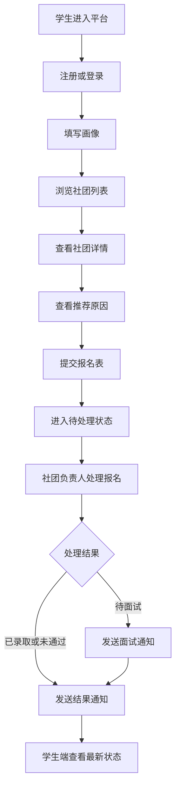
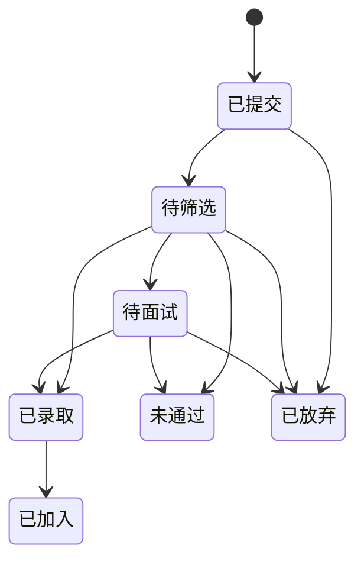

# 社团招新智能平台MVP版PRD

## 1. 文档信息

| 项目 | 内容 |
| --- | --- |
| 项目名称 | 社团招新智能平台 |
| 版本 | V1.0 MVP |
| 产品目标 | 帮助新生快速发现并加入适合的社团 |
| 建设范围 | 单校场景 |
| 目标角色 | 学生、社团负责人、学校管理员 |

## 2. 背景与问题

高校社团招新通常存在以下问题：
- 社团信息分散，新生无法快速了解社团差异
- 报名渠道分裂，线上线下混杂，流程不透明
- 社团筛选低效，学生和社团双方沟通成本高
- 学校缺少统一管理抓手，招新节奏与数据不可视

因此需要建设一个统一平台，打通“社团发现-智能匹配-在线报名-结果通知”的完整闭环。

## 3. 产品目标

### 3.1 用户目标
- 新生可以低门槛了解社团
- 新生可以快速判断哪些社团适合自己
- 新生可以在线完成报名并跟踪进度

### 3.2 业务目标
- 提高社团报名转化率
- 缩短社团处理报名的时间
- 让学校统一掌控招新周期与内容合规

### 3.3 成功指标

| 指标编号 | 指标名称 | 指标说明 |
| --- | --- | --- |
| KPI-01 | 详情转报名率 | 查看社团详情后发起报名的比例 |
| KPI-02 | 推荐点击率 | 推荐位点击比例 |
| KPI-03 | 报名处理时长 | 社团完成初筛的平均时长 |
| KPI-04 | 招新覆盖率 | 完成平台资料配置并上线的社团比例 |

## 4. 用户角色

| 角色 | 核心诉求 | 典型动作 |
| --- | --- | --- |
| 学生 | 找到合适社团、完成报名 | 浏览、筛选、报名、查进度 |
| 社团负责人 | 提高招新效率 | 发布计划、筛选简历、发结果 |
| 学校管理员 | 管控招新秩序 | 审核社团、管理周期、查看数据 |

## 5. 核心流程

## 6. 功能需求

### 6.1 学生端

#### 6.1.1 注册登录

**功能说明**：学生通过手机号或学号进入平台，并完成身份识别。

**字段定义**：

| 字段名 | 类型 | 必填 | 说明 |
| --- | --- | --- | --- |
| loginType | enum | 是 | `mobile`或`studentId` |
| mobile | string | 否 | 手机号登录时必填 |
| studentId | string | 否 | 学号登录时必填 |
| verifyCode | string | 是 | 短信或验证码 |

**业务规则**：
- BR-LOGIN-01：同一身份仅允许绑定一个学生账号
- BR-LOGIN-02：首次登录需补充基础资料

#### 6.1.2 兴趣画像

**功能说明**：学生填写兴趣方向、技能和时间偏好，用于推荐计算。

**字段定义**：

| 字段名 | 类型 | 必填 | 说明 |
| --- | --- | --- | --- |
| college | string | 是 | 学院 |
| major | string | 是 | 专业 |
| grade | string | 是 | 年级 |
| interestTags | array[string] | 是 | 兴趣标签，可多选 |
| skillTags | array[string] | 否 | 技能标签 |
| availableTime | enum | 是 | `low`、`medium`、`high` |
| expectedGain | array[string] | 否 | 期望收获，如社交、技能、竞赛 |

**业务规则**：
- BR-PROFILE-01：兴趣标签至少选择3项
- BR-PROFILE-02：画像提交后可再次编辑，推荐结果实时更新

#### 6.1.3 社团列表与搜索筛选

**功能说明**：学生浏览社团列表，并按分类、关键词、排序方式进行筛选。

**字段定义**：

| 字段名 | 类型 | 必填 | 说明 |
| --- | --- | --- | --- |
| keyword | string | 否 | 搜索关键词 |
| category | enum | 否 | 社团分类 |
| sortType | enum | 否 | `hot`、`deadline`、`matchScore` |
| recruitStatus | enum | 否 | `recruiting`、`closed` |

**业务规则**：
- BR-LIST-01：未审核通过社团不得出现在学生列表
- BR-LIST-02：关闭招新的社团默认降权展示

#### 6.1.4 社团详情

**功能说明**：向学生展示社团介绍、活动成果、招新要求、招新时间和推荐理由。

**字段定义**：

| 字段名 | 类型 | 必填 | 说明 |
| --- | --- | --- | --- |
| clubName | string | 是 | 社团名称 |
| clubIntro | text | 是 | 社团简介 |
| clubTags | array[string] | 是 | 社团标签 |
| recruitDesc | text | 是 | 招新说明 |
| recruitDeadline | datetime | 是 | 截止时间 |
| matchReason | array[string] | 否 | 推荐原因列表 |

**业务规则**：
- BR-DETAIL-01：推荐进入的详情页必须展示推荐原因

#### 6.1.5 在线报名

**功能说明**：学生填写报名表并提交到对应社团。

**字段定义**：

| 字段名 | 类型 | 必填 | 说明 |
| --- | --- | --- | --- |
| applicationId | string | 系统生成 | 报名记录ID |
| clubId | string | 是 | 社团ID |
| studentId | string | 是 | 学生ID |
| selfIntro | text | 是 | 自我介绍 |
| selectedDirection | string | 否 | 报名方向 |
| attachmentUrl | string | 否 | 简历或作品链接 |
| submitTime | datetime | 系统生成 | 提交时间 |

**业务规则**：
- BR-APPLY-01：同一学生不可对同一社团重复提交有效报名
- BR-APPLY-02：超出报名截止时间后不可提交
- BR-APPLY-03：提交成功后立即写入站内消息

#### 6.1.6 我的报名

**功能说明**：学生查看所有报名记录及状态变化。

**状态流转**：

**业务规则**：
- BR-STATUS-01：每次状态变化都需记录操作人和操作时间
- BR-STATUS-02：学生可主动放弃未最终结束的报名

### 6.2 社团端

#### 6.2.1 社团资料管理

**功能说明**：社团维护对外展示资料。

| 字段名 | 类型 | 必填 | 说明 |
| --- | --- | --- | --- |
| clubName | string | 是 | 社团名称 |
| category | enum | 是 | 社团分类 |
| description | text | 是 | 简介 |
| tags | array[string] | 是 | 社团标签 |
| contactPerson | string | 是 | 负责人 |
| posterUrl | string | 否 | 宣传图 |

**业务规则**：
- BR-CLUB-01：资料修改后需重新进入管理员审核

#### 6.2.2 招新计划发布

**功能说明**：社团配置招新时间、方向和报名字段。

| 字段名 | 类型 | 必填 | 说明 |
| --- | --- | --- | --- |
| planName | string | 是 | 招新计划名称 |
| startTime | datetime | 是 | 开始时间 |
| endTime | datetime | 是 | 结束时间 |
| directions | array[string] | 否 | 招新方向 |
| recruitCount | int | 否 | 预计人数 |
| customFields | array[object] | 否 | 自定义报名项 |

**业务规则**：
- BR-PLAN-01：招新计划必须落在学校配置的招新周期内
- BR-PLAN-02：结束时间必须晚于开始时间

#### 6.2.3 报名管理

**功能说明**：社团负责人查看报名者列表，按状态或条件筛选，并处理结果。

| 字段名 | 类型 | 必填 | 说明 |
| --- | --- | --- | --- |
| applicationStatus | enum | 是 | 当前状态 |
| reviewNote | text | 否 | 处理备注 |
| interviewTime | datetime | 否 | 面试时间 |
| resultNote | text | 否 | 结果说明 |

**业务规则**：
- BR-REVIEW-01：状态处理必须符合预定义状态流转
- BR-REVIEW-02：录取和淘汰结果发布后，学生应收到通知

### 6.3 管理端

#### 6.3.1 社团审核

**功能说明**：管理员审核社团入驻信息和招新计划。

| 字段名 | 类型 | 必填 | 说明 |
| --- | --- | --- | --- |
| auditStatus | enum | 是 | `pending`、`approved`、`rejected` |
| rejectReason | text | 否 | 驳回原因 |
| auditTime | datetime | 系统生成 | 审核时间 |

**业务规则**：
- BR-AUDIT-01：驳回时必须填写原因

#### 6.3.2 招新周期管理

**功能说明**：管理员统一配置校级招新时间窗口。

| 字段名 | 类型 | 必填 | 说明 |
| --- | --- | --- | --- |
| seasonName | string | 是 | 如`2026秋季招新` |
| seasonStart | datetime | 是 | 开始时间 |
| seasonEnd | datetime | 是 | 结束时间 |
| status | enum | 是 | `draft`、`active`、`closed` |

**业务规则**：
- BR-SEASON-01：同一时间仅允许一个`active`状态招新周期

#### 6.3.3 基础数据看板

**功能说明**：管理员查看平台运行情况。

**核心指标**：
- 社团总数
- 审核通过社团数
- 报名总人数
- 热门社团Top N
- 各学院报名分布

## 7. 推荐策略

### 7.1 首期方案

首期采用规则推荐，不引入复杂模型。

**建议分值公式**：

`matchScore = interestScore * 0.5 + timeScore * 0.2 + skillScore * 0.2 + hotScore * 0.1`

### 7.2 推荐解释模板

- 因为你选择了`摄影/媒体`兴趣标签，该社团与兴趣方向高度相关
- 因为你的可投入时间为`medium`，该社团活动频次较匹配
- 因为你具备`设计/运营`技能标签，适合该社团当前招新方向

## 8. 非功能需求

| 编号 | 类别 | 要求 |
| --- | --- | --- |
| NFR-01 | 可用性 | 学生端核心链路操作步骤不超过5步 |
| NFR-02 | 性能 | 社团列表首屏加载时间应控制在合理范围 |
| NFR-03 | 可维护性 | 推荐规则应支持后台配置或代码常量配置 |
| NFR-04 | 安全性 | 报名数据和个人信息仅对授权角色可见 |

## 9. 风险与约束

| 风险 | 说明 | 应对建议 |
| --- | --- | --- |
| 冷启动数据不足 | 首期无法做精准算法推荐 | 先用规则推荐 |
| 社团资料质量参差 | 推荐和展示效果受影响 | 增加审核机制和资料规范 |
| 招新流程差异大 | 各社团面试流程不一致 | MVP先做通用状态流转 |

## 10. 里程碑建议

| 阶段 | 目标 |
| --- | --- |
| 第1阶段 | 明确范围、原型确认、字段冻结 |
| 第2阶段 | 学生端和社团端主链路开发 |
| 第3阶段 | 管理端与基础数据上线 |
| 第4阶段 | 联调测试与首轮试运行 |
